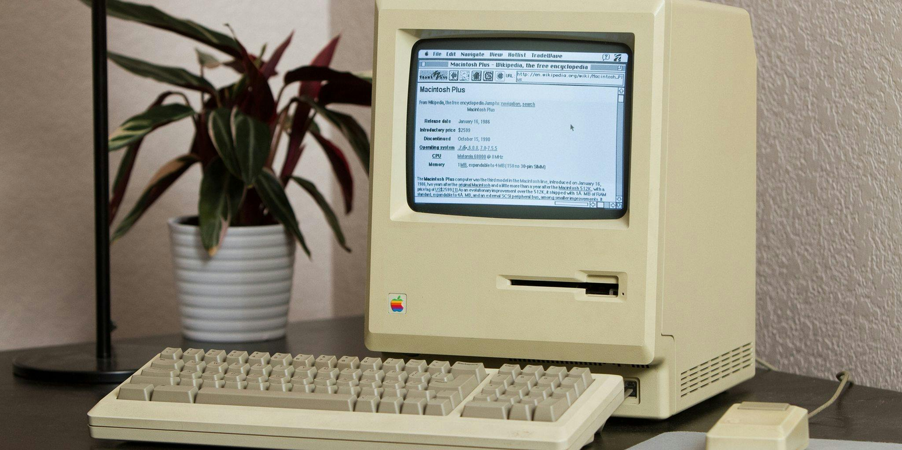

## At my roots

Being born in that middle age where modern digital technology was booming and growing at a rapid pace, it was only a matter of time before my life revolved around it. Down in the muggy, dimly lit basement of my grandparent's house housed a variety of gaming systems, all to my heart's content. All in one night, I would go from playing *Battletoads in Battlemaniacs* on the SNES to *TMNT* on the GameCube to *Super Mario 64* and *Super Smash Bros.* on the Nintendo 64. This quickly led to playing games on my Android tablet that I eventually found out about rooting and other things closely related. All this sparked my interest in becoming a game developer at a very young age, however, that idea went out the window overtime...

## The middle age
Going into middle school, I became more indulged in technology and would want to tinker with them as much as I possibly could (mostly software-wise). I remember jailbreaking my iPod Touch with Phoenix and installing all kinds of tweaks that drained my battery to 0% in a few hours. I got a PS Vita, which quickly got homebrewed as well, and all of my phones have been jailbroken or rooted ever since. This interest of mine led me to take a coding class in High School because I wanted to be just like those people who hacked into things and thought it was super cool, until I found out that it wasn't as easy as just pressing a button and things happening like magic. Through this coding class, however, I began to discover other branches of technology like robotics, web development, and aspects of software development, which are coming full circle now as I am refreshing myself with software development. I never really found anything that really interested me until I got to college, where I figured, why not try data science?

## Current day

My interest in software engineering grew from the tinkering I did as a kid. My **focus** of what I wanted to do changed over time from game developer to cybersecurity to cloud development, but recently I had an interest in data science. For the specifics, I am not sure what exactly I want to do still, maybe machine learning engineer, but I do want to generally work with collecting and analyzing data, and with that data, I want to be able to create meaningful predictions and implement those predictions in a way to improve whatever it is that I am working with. It is a *very* general way to say what I want to do, but nonetheless, that is my current interest because I want to be able to understand the world in a way that mathematicians see the world. I want to be able to look at numbers and see why they are what they are and how they got there because that is what our world runs on, and I wouldn't want to fall behind.
