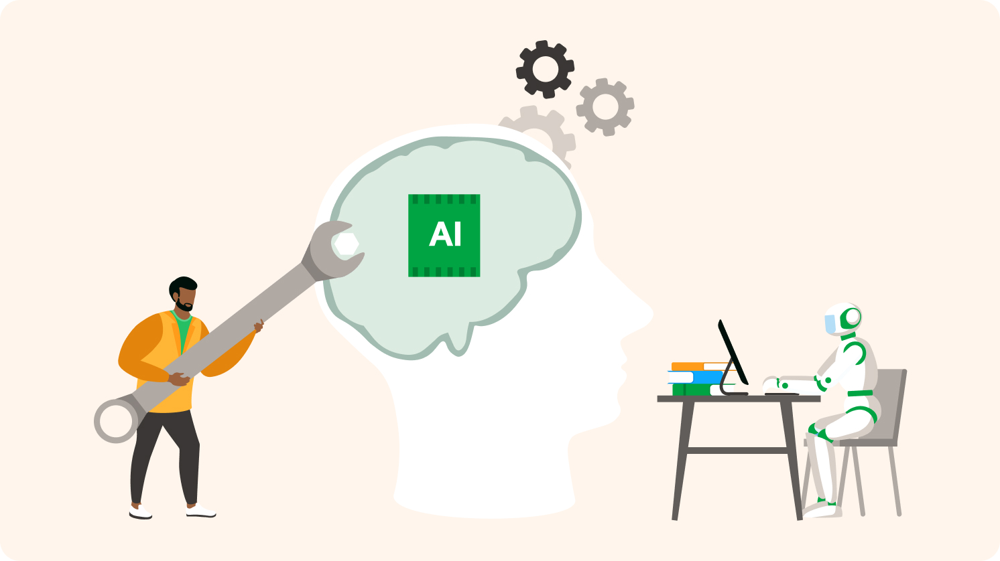

<p style="align: center">

</p>

## Surge of Artifical Intelligence
AI is a hot topic for a multitude of reasons, and it has had such a heavy impact on how our world is today. The use case for AI that is relevant for me, however, is in education, since I am a student at the University of Hawaii at Manoa. It is quite obvious that ever since ChatGPT was released in 2022 to the public, there has been an immediate surge in students using it to complete their assignments. No matter where I am walking when I'm on campus, whether it be past the chemists of the future in Bilger Hall, the intellectual mathematicians in Keller Hall, or even the assortment of people enjoying their lunch while studying in Paradise Palms Food Court, there is always at least one person that has ChatGPT open to answer the questions that they themselves do not know how to answer. I am not out of the minority, however, as I will use ChatGPT as well as GitHub Copilot when I am coding and to assist me in other classes as well.

## Education Cohabiting with AI
I am currently taking a Software Development class titled ICS 314, and interestingly enough, this class *allows* the use of AI and does not penalize for the use of it. For the **experience WODs** (workout of the day) that we were assigned as our homework, I used AI for only 1 of them because the experience WODs helped me learn the basics of whatever topic we were covering that week, and I did not want to skip out on learning the basics, so I did nearly all of them the traditional way. I remember using ChatGPT for that one experience WOD because I couldn't figure out how to solve the WOD even after 3 attempts, but it wasn't all that helpful in helping me solve the problem.

For our **in-class practice WODs**, I had the same mentality in the sense that I did not want to be given the graded WOD and be completely lost, so I did nearly all the practice WODs without AI. I also did this because I knew that the graded WODs would be similar to the practice WODs, and sometimes they were nearly identical with their solutions. There may have been one or two times that I used AI, but I can't quite recall, and I'm not sure if it helped much either. If anything, I might have had GitHub Copilot installed as an extension for VS Code but never did give Copilot a prompt for my code and only used it for its suggestion feature to automatically create lines of code based on what it *thinks* is being created from the code, which was quite helpful.

For our **in-class WODs** which were graded, I used GitHub Copilot on four of them, but I used it the same way as I used Copilot for the practice WODs. I didn't give any prompts to Copilot and instead opted to only use it for its suggestion feature because I did not want to rely fully on AI to do the work for me. I thought it was important for me to find an answer on my own and to learn how to solve the WOD and relying on AI would hinder my learning. For both my practice WODs and in-class WODs, the Copilot suggestions were quite helpful because they shaved off minutes that I would have spent reading documentation to write the code. For my use case, it was quite helpful because I used Copilot for trivial tasks that I could have done on my own in a few minutes but instead used AI to do them with just a key press.

For the [**essays**](https://bryannak.github.io/#essays) we had to write in our class, I never used AI because I didn't really see a need to use it to write my essays. I don't particularly hate writing essays because it helps me express my thoughts and feelings, and writing an essay with AI would remove the "me" part of my own essay. I would feel like I'm going against my morals if I were to construct an essay with the assistance of AI because it would be taking away the effort that I put into my essays as well.

For my [**final project**](https://uh-marketplace.github.io/) which I worked on with a few of my classmates, I did use GitHub Copilot. In the beginning, I didn't give any prompts to Copilot because there wasn't anything overly complex to do, just tasks that were similar to the WODs that we were assigned to do. Similar to the WODs, I used it mostly for its suggestion feature to speed up my workflow. Later in the project, however, when I was given a task in a file that I did not originally create or work on before, the code became quite difficult to interpret. There was a lot of code from my group mates that was generated by AI, so I had to use Copilot to understand what was happening and to also create code for some parts I couldn't understand. Unfortunately, I don't have the exact prompts that I used, but I have a vague memory of some of them. For example, one time I had to work on a file that my group mate had worked on and there was a way of retrieving user items from the database shown below:

```javascript
 const stuff = await prisma.item.findMany({
    where: {
      owner,
    },
  });
```
which retrieves the owner's item in the item table. What my groupmate had coded was this:
```javascript
    const fetchUserItems = async () => {
      if (session?.user?.email) {
        const res = await fetch('/api/get-user-items', {
          method: 'POST',
          headers: { 'Content-Type': 'application/json' },
          body: JSON.stringify({ email: session.user.email }),
        });
        const data = await res.json();
        if (data?.items) {
          setItems(data.items);
        }
      }
    };
```
which does the same thing, but the latter works by using an API call that they created, and so I had no clue how to work it. In the end, I just asked Copilot, "What do lines ##-## do?" and with that, it swiftly explained to me what this piece of code does. It was quite helpful in explaining what the code does; however, when there were errors in my code that I couldn't figure out and I asked Copilot to fix it by clicking the "fix using Copilot" button, the fixes were 50/50. There were times when the fix did work and everything worked as intended, and there were also other times where, rather than fixing the code, it would create more problems and whacky workarounds that just looked terrible.

When **learning a new concept** in ICS 314, I don't think I ever used AI to help me learn. Outside of ICS 314, I have used AI to help me learn new concepts, but the content that I learned in ICS 314 never really warranted the use of AI. The one thing I did the most when learning something new was to just read documentation and to see the examples that were provided([react-bootstrap](https://react-bootstrap.github.io/docs/getting-started/introduction), [bootstrap](https://getbootstrap.com/docs/5.3/getting-started/introduction/), etc.). Reading the documentation helped me pretty much every time I needed help with some code, and so AI wasn't really necessary with this.

Whenever I **answered a question in class**, I never had the need to use AI to help me answer because I only ever answered a question if I was sure I knew the answer. I didn't answer many questions in the Discord server for our class because, most of the time, I didn't know the answer and did not want to lead someone down the wrong path.

In the Discord server, there was a channel called **smart-questions**, which I didn't ask any questions in;  however, it was helpful a handful of times when I had the same problem as someone else and another classmate had a solution. I never did answer any questions either because, again, I didn't want to give someone the wrong answer and it hurt them. For this reason again, I never sought to use AI to ask or answer questions in the channel because I wouldn't have been able to easily verify if the answer ChatGPT would give me is correct or not, and I could give someone the wrong answer.

One way of learning a new framework would be to get a **coding example** from AI, but again, I never did this because, more often than not, the documentation for that framework provided an ample amount of examples that fit the description of what I was trying to do; therefore, I never needed to ask ChatGPT to provide me an example.

I have used GitHub Copilot to **explain code** to me, as was previously stated in my final project. Outside my final project, I never really had the need to use AI to explain code to me because, as stated in the previous paragraph, I read documentation whenever I was confused about some code that worked for me.

When **writing code**, I have definitely used Copilot for help because there are some things that I felt that Copilot could probably write better than myself given the time constraint I had for certain things, such as my final project. Taking my example from my final project again, there were times when I could not understand how to fix some errors that were being thrown, so I used the "fix using Copilot" button to attempt a fix to the problem. As I previously stated, the solutions that Copilot gave me worked about 50% of the time.

I did **document code** with Copilot not directly, but because when it generated code, it automatically created short comments for what the code created does. The comments created were not the most explicit, but they were very brief and, for the *most* part, explained what the code did.

I never used AI for **quality assurance** because I already have ESLint installed in VS Code, and it could automatically fix problems such as trailing spaces or new line errors. ESLint would also explicitly tell me the error that was occurring so I could easily figure out how to fix that specific error, and because of that, I never had a reason to use AI to fix the problem. I think I might have tried to use AI to fix my problems once or twice, but it would give unnecessarily lengthy solutions, so I opted to solve them myself.

**Outside the usage of AI in my ICS 314 class,** which I discussed above, I have not used AI in any other way. The main reason for this is that I feel as though I will not learn nearly as much as I would if I were to rely on AI all the time and I don't always trust it to provide me with the correct information, even if it might give it to me 80% of the time (unless I were able to verify the solutions myself).

## Impact on Learning and Understanding
Having used AI for quite some time now, I can easily tell that whenever I do use it, I learn significantly less compared to when I study or do homework without it. This topic is, of course, subjective and may only apply to myself. Incorporating AI into my learning experience has not always had a hindering effect because when I use it to explain things to me, it is actually quite helpful. AI has definitely helped my comprehension with its explanations; however, I feel as though my skills do not develop as well compared to doing my work without AI. When I use ChatGPT or Copilot, my skills do not develop but rather, I just learn how to solve specific problems that I was tasked to solve. My problem-solving abilities do not get any better either because I am given the solution (unless I prompt the AI not to) right off the bat and I did no work at all to reach the solution. I think when used correctly, AI can enhance my understanding of software engineering concepts and my learning experience as a whole, but I am always tempted to prompt it for the answer to my questions rather than use it as a tool to *assist* me in reaching a solution.

## Practical Applications
Similar to my case on my final project, some code can be trivial or repetitive to write and with the help of AI, this process can be streamlined quite efficiently depending on the complexity of the code which needs to be written. For example, when writing a button in react-bootstrap with some special styling, it isn't particulary difficult to look at the documentation for buttons in react-bootstrap and to create one yourself, but it would be *so* much faster to just ask ChatGPT or GitHub Copilot to create one for you. Another thing would be creating tests for your code or even just using AI to check your code for bugs before running it which could return incorrect bugs, but if it works then it would cut down quite some time.

## Challenges and Opportunities
A challenge I've encountered in the use of AI within this course is definitely its  ability to solve problems in coding. When I was given a solution from GitHub Copilot for my code when I was trying to write a function, for example, it would give me a very hacky way to do it, and in the long run, the code became much more convoluted and confusing when it could have been done in a much simpler way. A limitation that I ran into as well was that it started to struggle with prompts once it was given multiple files and asked to do something with all of them involved.
In my opinion, I believe that AI is a double-edged sword for education. It is quite useful for education because of how easily accessible it is for anybody to use and its wide variety of use cases. The biggest problem in terms of education, however, is the fact that students are more likely to use it for cheating than learning. Every student (including myself) has tried to find answers to our homework because we are too lazy to do our homework ourselves, and ChatGPT has made it so much easier to get the answer now. Instead of looking through pages upon pages of Chegg, we can get a direct answer, and this accessibility and ease of use make us not want to do our homework ourselves ever again. I find it hard to think of a way in which AI can be incorporated into software engineering education without hindering the learning experience of students.

## Comparative Analysis
Comparing traditional teaching methods and AI-enhanced approaches, I find traditional teaching methods to be much more effective (at least for myself). This might just be me, but I find it difficult to hold myself accountable in my learning with AI. It is always so tempting to ask ChatGPT to just give me a straight answer rather than critically thinking about what I am trying to solve. In the traditional method, I don't have something next to me to rely on to connect the dots for me, and instead all I have is my own understanding. If I don't understand a topic enough, then I'll refer back to notes to reinforce my understanding and to critically think about *how* the dots are connecting. With AI, I don't critically think about anything because it is doing all the critical thinking for me. All I'm critically thinking about is how I should formulate my prompt for ChatGPT to give me the correct answer. Not only does ChatGPT do all the critical thinking for me, but it also "remembers" everything for me, so I don't have to memorize anything. This may just pertain to how I use AI, but when I do, it's not like I'm remembering anything because if I ever have the same question that I need an answer to, I can just ask it the same prompt, and I lazily put no effort into trying to remember how something may work, why it works, and how to get to that working solution. With traditional learning, I am "forced" to retain knowledge a little more because I can't ask my notebook a particular question and get an answer out of it. I would have to read through my notes, read what I am trying to understand, and if I don't understand it enough, I would have to shift backwards and read previous notes to strengthen my foundations of that topic. Instead of going through this whole process, it would be much easier if I just retained the knowledge, hence the motive to retain knowledge. For practical skill development, I find the traditional method to be much more impactful compared to AI-enhanced because, in practice, you may not always have access to AI, and even if you did, it may not always return the right answer. By going through trials and errors, it helps me learn much more about a topic or a question compared to skipping the whole trial and error process and using AI to do that part for me.

## Future Considerations
Research and innovation in the field of AI is continually growing at a quick rate and in tandem, so will the future of AI in software engineering education. The most important advancement which could be made, is for AI to return the correct information when asked a question. Something that always made me weary of using AI is it's tendency to return information which is incorrect and because of this, I would have to go through trial and error of trying to pry out the correct information. This is of course no easy feat and is an incredibly difficult task, but overtime, LLMs are learning more and more as more data is being fed in so this may be achieved one day. At the same time however, it is difficult to verify if information that is spit out is "correct" if you don't have a key of sorts to tell you that that answer is "correct". Maybe someday the people who work on LLMs will be able to solve this problem.

## Conclusion
Overall I thought it was an interesting choice to allow AI in the Software Engineering course. I like how adaptive the course was to rather than shutting down the usage of AI, realizing that students would probably use it anyway and so allowing it would be a perfect way to get further insight on the impact of AI on education. It is honestly hard for me to think of ways in which AI integration in future courses could be further optimized because it is more dependent on the individual students and their motives, whether it be to genuinely learn and build up their critical thinking skills, or to just get the work done and get a good grade. If the student is not motivated to learn or to put in the effort to learn, then what would it matter if they used AI or not? To me, the only way to optimize the integration of AI in future courses is to first focus on the students and to ensure that their motives are focused on learning and only then will they use AI as a tool to *assist* their learning rather than a tool which *does* the learning for them.