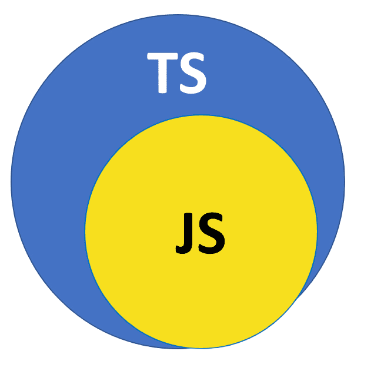

Delving into TypeScript has been a familiar yet unchartered territory, similar to a feeling of *Déjà vu*. When I was in high school, I had taken multiple coding classes which introduced me to front-end web development and the main languages involved: HTML, CSS, and **JavaScript**. During this time I had dabbled in some *ES6* which albeit on paper is better than *ES5*, I was stubborn in learning the new syntax, and I didn't think much of it. Little did I know that it would come back around, but this time with a different color and a different *name*... 

## The Reunion

About a week ago I did a nice (re)introduction to JavaScript on FreeCodeCamp's [JavaScript Algorithms and Data Structures Certification](https://www.freecodecamp.org/learn/javascript-algorithms-and-data-structures/) and completed the first subsection named **Basic JavaScript**. The first couple of lessons were a bit rough, but like riding a bike after a long absence, the memories began to return, and soon enough the section was completed. I thought I was doing great and moved on to the next subsection titled *ES6* which immediately gave a nice slap back to reality.

### JavaScript 2.0



Doing the *ES6* portion of the certification felt like learning the dialect of a language that you already knew and got comfortable using. After all the years I was used to JavaScript, learning *ES6* and eventually TypeScript (which uses the same syntax + some extra goodies) felt like reading Early Modern English—comprehensible but, at the same time, not really.

```javascript
function printHelloWorld() {
console.log("Hello World!");
}
```
*could* turn into:
```javascript
const printHelloWorld = () => console.log("Hello World!);
printHelloWorld();
```

The hardest part for myself was definitely learning all the new syntax and restructuring of code. When I first saw arrow functions, I couldn't wrap my head around it because I was so hardwired to read JavaScript code, but I am slowly but surely getting better at understanding TypeScript syntax. 

Another thing that threw me off was the way that variables are handled, since TypeScript is **object-oriented** friendly. All of a sudden I couldn't declare variables by just `var` but had to use `let` and `const`. Parameters and return types are all new too, since it is now better to *specify* them with types such as `: number` or `: string`...a concept I have never heard of in JavaScript.


## Practicing a new dialect

I may or may not have *exaggerated* the differences of JavaScript and TypeScript syntax by just a little, but nonetheless, it is still something that needs to be practiced so that I can cement better practices in my code.

Doing WODs, which might include creating a simple function that converts Fahrenheit to Celsius in TypeScript, has been useful in my opinion because not only does it allow me to get familiar with TypeScript, but also improve my coding skills under pressure. I know that during the interview process for a job it is most likely that you will be asked to code some sort of program, and coding under pressure is not my *forte*, but thankfully practice WODs allow me to work on that.
