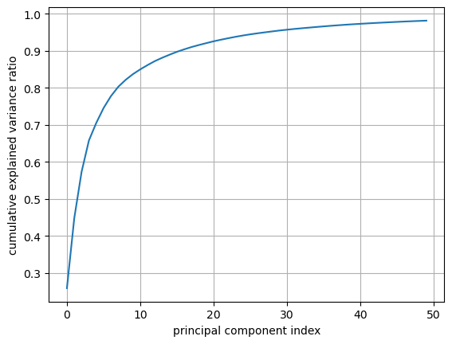
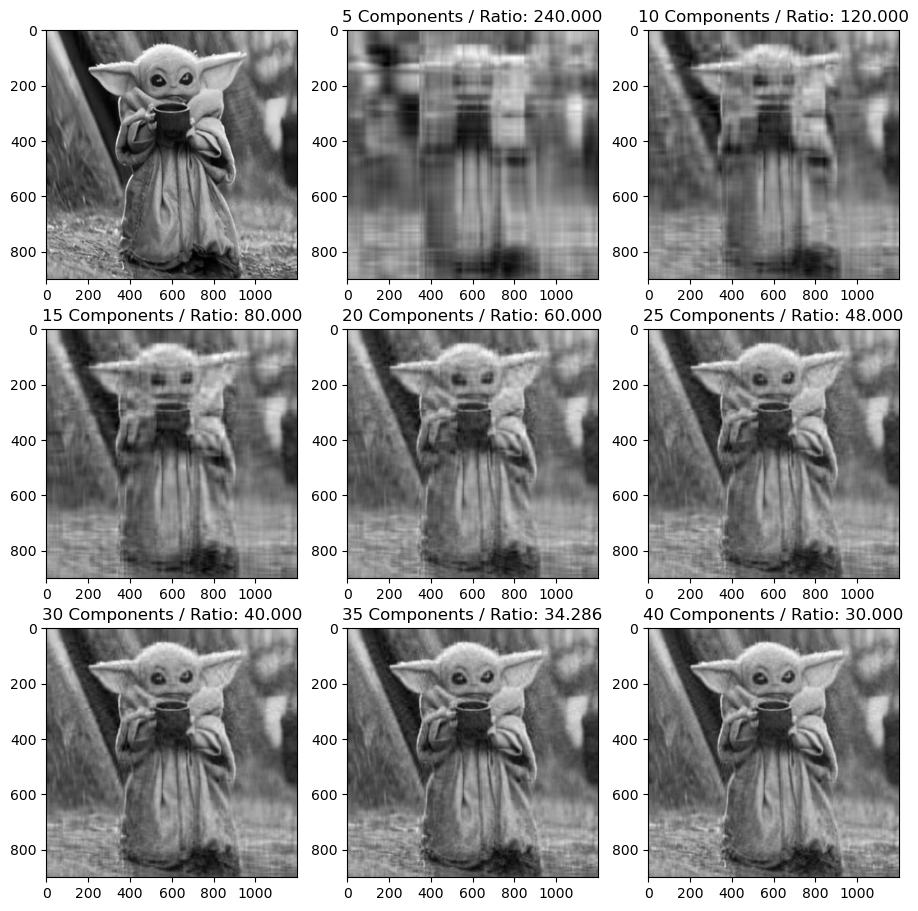

This program gives a very shallow, visual example of how Principal Component Analysis works and how it can be used to compress an image into a smaller size. This program *should* work with different images as long as the code is changed to the location of the new photo. Python libraries numpy, PIL (Python Imaging Library), and pyplot are used alongside the scikit-learn machine learning library to produce the results. By combining these libraries the program could produce outputs such as this:

  

This project allowed me to see the workflow of data science in terms of analyzing and retrieving data, and the steps taken to get to the goal which in this case, is to visualize and acquire useful data using PCA on image compression. Going step by step in Jupyter Notebook is similar yet different compared to coding, say a program to sort a list. Developing this felt more like analyzing data and computing something useful out of it compared to other projects I have done.

 

It took quite some time to learn and understand what exactly PCA is but through countless hours of studying and googling I could somewhat wrap my head around what its uses are. Besides learning how PCA works, I also learned how the python libraries worked as well by reading the documentation as well as outside research. It was a challenging objective to get to but seeing the final result made everything make sense just through one graphic visual of how different number of components used can change the image quality:

    

Source code: <a href="https://github.com/BryanNak/PCA-Image-Compression"><i class="large github icon "></i>BryanNak/PCA-Image-Compression</a>
