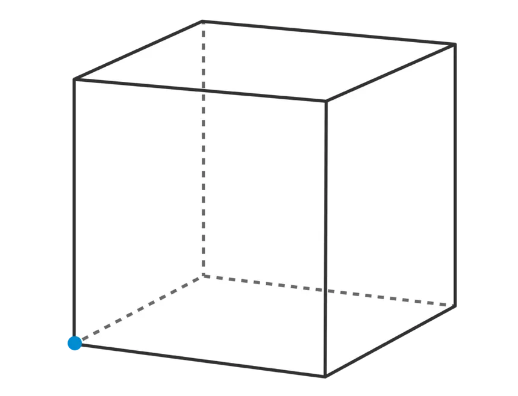

<p align="center">

</p>
This is a simple shape properties calculator for seven 2D and 3D geometrical shapes that I created in C++. The program will display a list from 0-6 with each number associated with a shape (circle, sphere, cylinder, square, cube, triangle, tetrahedron) and give the user the choice to choose a shape. The user can input 7 otherwise to quit the program. The program takes an integer from 1 to 7 from the user, asks for additional information about the shape, and calculates and prints basic properties of the shape that the user selected.   

Here is an example of obtaining some properties of a cube:

```
user:~$ ./program
Select an object from the menu (enter 7 to quit).
        0. Circle
        1. Sphere
        2. Cylinder
        3. Square
        4. Cube
        5. Triangle
        6. Tetrahedron
4
Enter the Cube's side: 10
The Cube's surface area = 600
The Cube's volume = 1000
```

This program was fundamental for learning the basics of class hierarchy and how I can manipulate class properties down the hierarchy. At the time of taking this class, class hierarchy was not something that I was comfortable with albeit being a simple concept in hindsight. In science, class hierarchy is used for biological classifications and similarly in coding, it is used in the same way. The parent abstract Shape class is used to provide basic details for all the shapes while the latter classes can spawn their own specifics within themselves.

```cpp
class Shape {
	public:
		/** Returns the name of the class. */
		virtual const char* name() const = 0;
		/** Prints the area or surface area, and volume of the object. */
		virtual void printDetails() const = 0;
		/**
		 * Prompts the user to enter a radius, side, and/or height
		 * of the object and set the appropriate data member(s).
		 */
		virtual void inputData() = 0;
		/** Calculates and returns the area or surface area of the object. */
		virtual double area() const = 0;
		/** Calculates and returns the volume of the object. */
		virtual double volume() const {
			return 0.0;
		}     
};   
```
By developing this program, I could better visualize how class hierarchy could be used in coding. There are many cases in object oriented programming where you might want a template of a multitude of objects similar in structure so that you don't have to be redundant in the code. This concept is so simple, yet sometimes I catch myself not even thinking about how I could simplify code by using this idea of creating a template that can generalize to various objects without being to specific.
<hr>

Source code: <a href="https://github.com/BryanNak/Shape-Properties-Calculator"><i class="large github icon "></i>BryanNak/Shape-Properties-Calculator</a>
