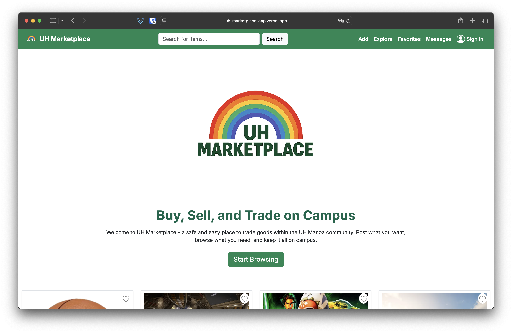
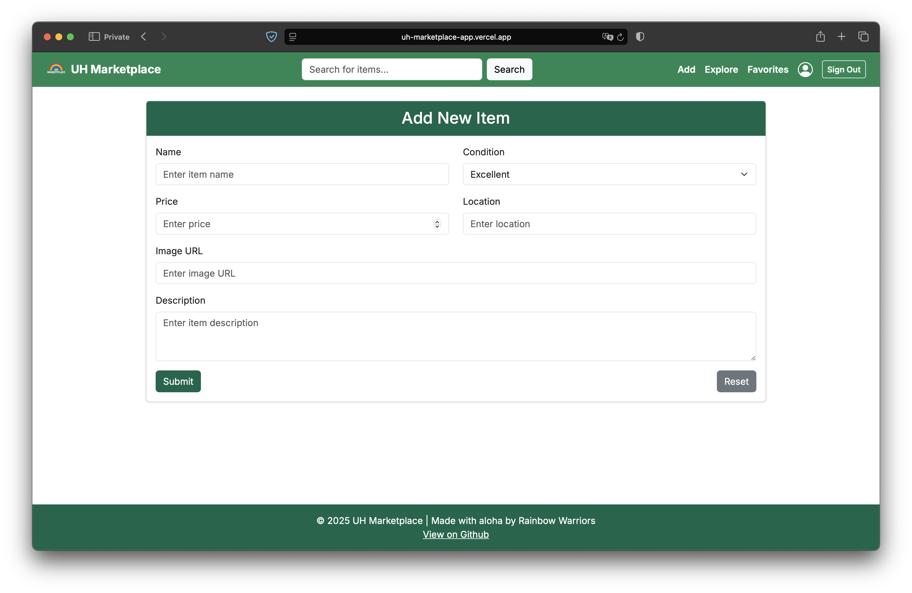
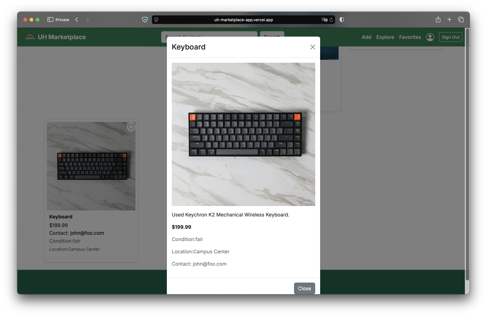

For my ICS 314 Software Engineering course, I was tasked with creating an application with a group of my classmates which utilized all the skills I had accumulated over the semester. We had a few options to choose from for our application but ultimately landed on an application which allowed students to sell, buy, or trade their goods with other students at UH Manoa. This project was rooted out of a next.js template given to us which we modified and throughout the whole process, we were tasked to follow [IDPM Guidelines](https://courses.ics.hawaii.edu/ics314s25/morea/project-management/reading-guidelines-idpm.html) which is an [agile project management](https://www.apm.org.uk/resources/find-a-resource/agile-project-management/) process designed to support up to a dozen developers creating software up to approximately 500K LOC with “web app” grade quality.

 

This project was a great learning experience for myself, as I was able to experience working with a group on a web application, which allowed me to experience new events that I never had before.

Although we had 6 group members, only 4 of us were actively working on it and had to pick up the slack in which our 2 other members had not done. This was quite a bit of a challenge to overcome because after the first week into our project, we didn't know if we could rely on our group mates to produce results for the tasks that they were assigned to and could not entirely omit their responsibility in our group project as they were *technically* still a part of our group.

In this project, my duties were to create a landing page, update sections of our GitHub organization homepage, implement an add page that allows the user to add a listing to the marketplace, and to create playwright tests that ensure the pages load and work properly throughout the web application. In between these duties, I also patched up small errors such as incorrect usage of prisma models, incorrect object property names, and others similar. I also fixed up the aesthetics of the site here and there to make it look a little nicer.

  

    
    
<em>Add Page</em>

  

  

    
    
<em>Modal Popup for Items</em>

  

Source code: <a href="https://github.com/uh-marketplace/uh-marketplace-app"><i class="large github icon "></i>uh-marketplace/uh-marketplace-app</a>
 
Organization Homepage: <a href="https://uh-marketplace.github.io/">UH Marketplace</a>